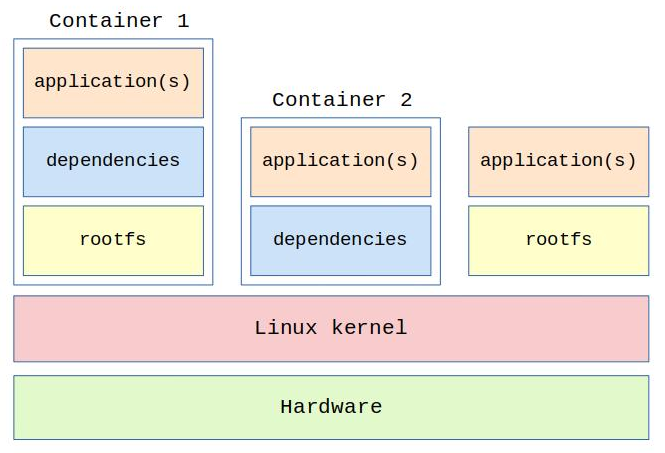
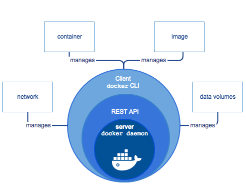
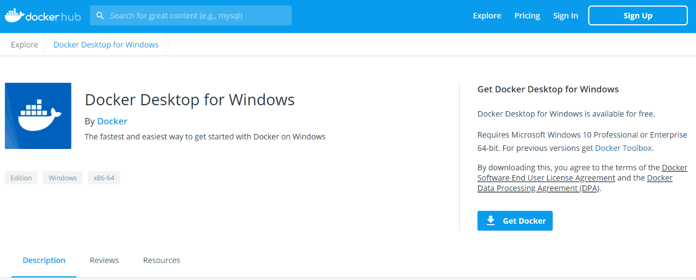
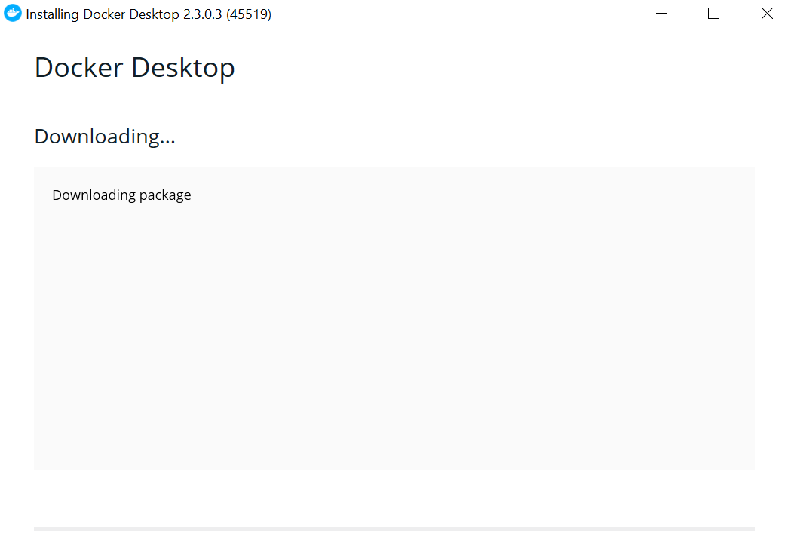
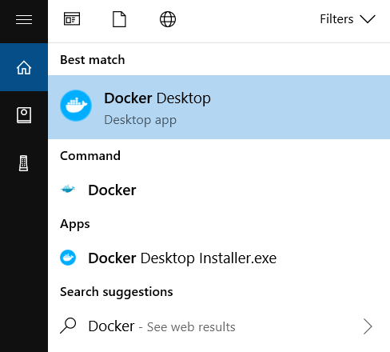
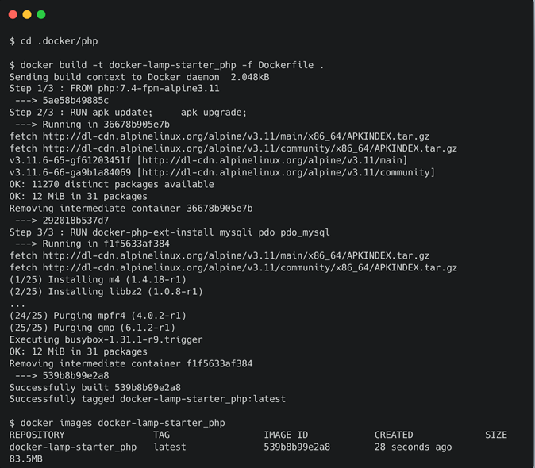
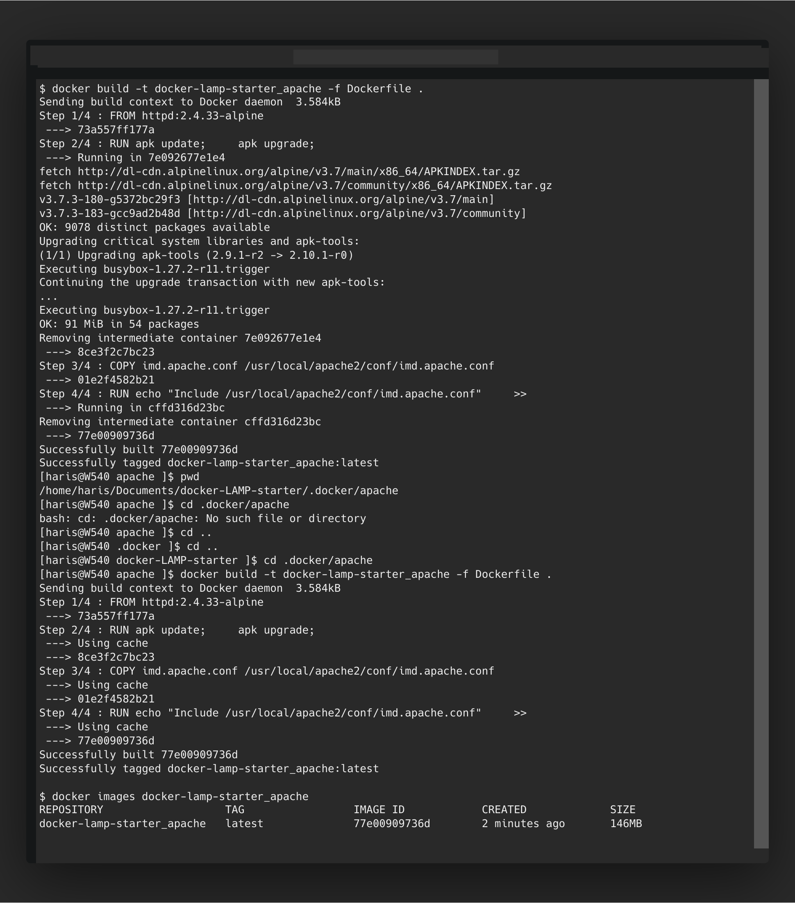
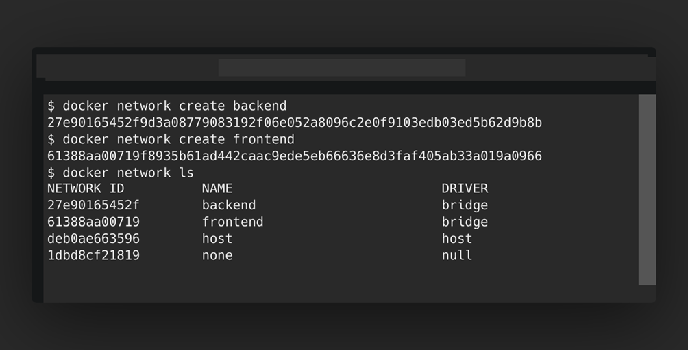
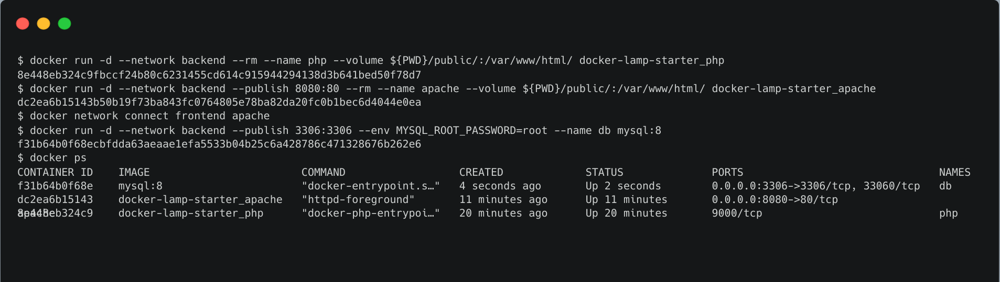
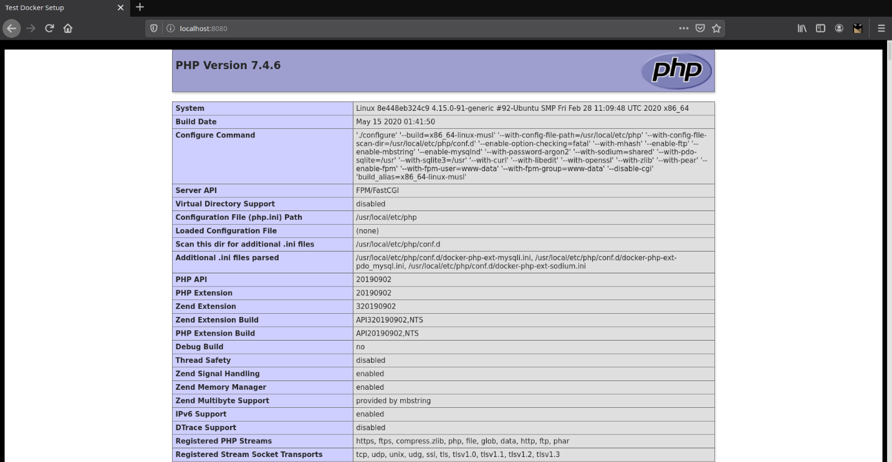

# LINUX CONTAINERS

## History

Trough the history implementation of several different components and products led to container stack
as we know it today:

- 1979 – Unix operating system chroot system call for changing of the root directory of a process
  was introduced
- 1982 – Chroot was added to BSD.
- 2000 – FreeBSD jails operating-system system call similar to chroot but includes more process
  sandboxing features.
- 2001 – LinuxVServer another Jail mechanisms to securely partition resources
- 2004 – Solaris containers introduced in x86 and SPARC systems
- 2005 – Open VZ. Make use patched Linux kernel for providing virtualization, isolation, resource
  management and checkpoint.
- 2006 – Process containers were implemented in Google for limiting, accounting, and isolating
  resource usage of a process collection. Later it was renamed into control groups and merged to
  Linux kernel 2.6.24.
- 2007 – Control groups added to the Linux kernel.
- 2008 – LXC most complete implementation of Linux container manager was implemented using
  C groups and Linux namespace.
- 2013 – Docker. The most popular and widely used container management system was
  introduced. Unlike any other container platform, Docker introduced an entire ecosystem for
  managing containers.
- 2016 – Windows containers support added to Microsoft Windows server operating system.[1]

## Introduction

Concepts in implementation of options to share hardware resource within the computer processing unit
has evolved as hardware capacity evolved through time. At the beginning computers were implemented
as mainframe systems with many “dumb” terminals, in such architecture all the processing was
performed on the central processing unit (CPU) where the operating system was responsible to share
the resources among users and processes. To achieve virtualization software called hypervisor was
introduced around 1960 for different operating systems on mainframe computers. In the second phase
of development of computer hardware, “personal computers” (PC) architecture has become
mainstream and the development of network infrastructure focus has moved from mainframe to client-
server architecture. In such architecture, processing has been done on both client terminals and the
server itself. With the time, as hardware capabilities, improved servers have become capable of running
several different software systems processes of software therefore, virtualization as technology has
been adopted into the industry. Hypervisors are introduced again around the year 2000 for Linux and
Unix systems to use virtualization technology and expanded hardware capabilities. Even though
virtualization technology-enabled computers to run many virtual machines on the servers, with the time
it becomes obvious that “full” virtualization is not always required and therefore represented ways of
resources in the case when software can actually run on the shared resources provided by the very
same operating system of the server itself. This idea led to the development and implementation of
containers technology which soon becomes a part of standard Linux and Unix kernels. Container
technology represents a platform implemented into the operating system which consists of tools and
libraries requires to run container images in isolated environments on which different resource limits
and security rules can be enforced. Virtualization technology especially becomes highly used for the
cloud computing platforms and as a result of that many cloud computing providers have contributed to
the development of container technology into the form of open source projects.

## Container technology implementation

For the purpose of this document, the implementation of container technology in the Linux operating
system will be presented. Linux containers are implementations of operating-system-level virtualization
for the Linux operating system. [2] With in the Linux container stack is implemented as the minimal fail
system which includes only the required software components to run specific applications or a group of
the application completely isolated from the rest of the system. A Linux container also solves a problem
of distributing applications to different environments using container images. Linux container is an
instance of the user space layer with a resource allocated to it (CPU, RAM, IO) and runs in isolation form
the rest of the system. [3]



Efforts to implement container into Linux are concentrated into LXC and LXD projects. LXC is a user
space interface for the Linux kernel containment features. Through a powerful API and simple tools, it
lets Linux users easily create and manage system or application containers. In order to achieve this
following feature were implemented to the kernel.

- namespaces (ipc, uts, mount, pid, network and user)
- Seccomp policies
- Chroots (using pivot_root)
- CGroups (control groups)

Using above features, it is possible to create an environment similar to standard Linux but, without need
for separate kernel. At present LXC is implemented as a set of a following components. [4]

- The liblxc library
- Programming languages paining API
- Tools to control the containers
- Distribution container templates

As a part of Linux containers stack LXD container manager is provided. There are premade images
available for many Linux distributions. LXD is built with a very powerful yet simple REST API. The core of
LXD is a privileged daemon which exposes a REST API over a local Unix socket as well as over the
network (if enabled). Clients, then do everything through that REST API. [4] Some of the most important features are:

- Secure
- Scalable
- Image based
- Advanced resource control
- Network management
- Storage management

LXD isn't a rewrite of LXC, in fact it's building on top of LXC to provide a new, better user experience. It's
basically an alternative to LXC's tools.[4] Both LXC and LXD are free software. Most of the LXC code is
released under the terms GNU LGPLv2.1+ license, while LXD is realized under the Apache 2 license.

## Docker

It is obvious form the previous chapter that implementation of Container technology requires many
software components scattered over multiple layers of OS stack. Therefore, there was recognized
requirement to have a tool which could simplify management of all components of the containers stack
implementation so, several such tools appeared over the time. A tool called Docker become wildly
adopted by the users and have become de facto a standard container management tool over all OS
platforms.

In 2013, Docker introduced what have become the industry standard platform for Container
Management. Docker offers unique experience for containers management and operations form
desktop to the cloud. Essentially Docker is implemented on three key points: Docker Demon, Docker
Command line tool and Docker Image Registry. Docker is distributed in community and enterprise
versions.

Docker unable developing, shipping and running applications isolated form the infrastructure. Using
Docker, it is possible to manage infrastructure the same way as applications are manage. Docker
provides ability to package and run an application in a loosely isolated environment called a Container.
The isolation and security allow you to run many containers simultaneously on a given host. Container
are lightweight because they don’t need extra load of a hypervisor but run directly with in the host
machine’s Kernel. [5]



Above picture represents general overview of the Docker architecture which consists of the following
manger components:

- A server - Dockerd deamon processes
- REST Application Programming Interface (API)
- A Command Line Interface (CLI) client – Docker command

The CLI uses Docker REST API to interact with the Docker deamon. The deamon creates and manages
docker objects: images, container, networks, volumes...

Docker is licensed under the open source
Apache 2.0 license. Probably, most significant reason for such wildly adoption docker among developers
and administrators is the fact that, unit of isolation – image prepared by developers or CI process is
guaranteed to work when deployed into production environment.
Docker Image is a read-only file system that contains instructions for creating a container docker that
can run an application. Users can use public images from the public registry (repositories which store
images) Docker Hub or private registry pertaining images related to your organization. Docker file is
used to build Docker images, it contains simple commands that the daemon executes to create and run
the image. The command in Docker file creates a special layer within the image

## How to use

For the purpose of this document in this chapter we will describe how to install docker on Window’s 10
platform and then how to use It to build images and run containers using multitier web application.
Docker Desktop is the best way to get started with Docker on Windows.
In order to use Docker on Windows it is necessary to install Docker Desktop for Windows community
version. Minimum requirements to install Docker desktop:

- Windows 10 64-bit: Pro, Enterprise, or Education (Build 15063 or later).
- Enable the WSL 2 feature on Windows.
- The following hardware prerequisites are required to successfully run Client Hyper-V on

Windows 10:

- 64-bit processor with Second Level Address Translation (SLAT)
- 4GB system RAM
- BIOS-level hardware virtualization support must be enabled in the BIOS settings. For
  more information, see Virtualization.

The Docker Desktop installation includes Docker Engine, Docker CLI client and Docker Compose. [6] To
enable Windows Sub System for Linux (WSL) open PowerShell as administrator and run the command:

```
dism.exe/online/enable-feature/featurename: Microsoft-Windows-Subsystem-Linux/all
/norestart
```

Then update to WSL2 but before updating make sure that Windows 10 is update to version 2004 build
1904 or higher. Before to installing WSL 2 you must enable virtual machine platform machine using
following command:

```
dism.exe /online /enable-feature /featurename:VirtualMachinePlatform /all /norestart
```

After machine restart set WSL 2 as default version using following command:

```
wsl --set-default-version 2
```

Next step is to download Docker Desktop installer from Docker Hub.


[https://hub.docker.com/editions/community/docker-ce-desktop-windows/]

Double click Docker Desktop installer.exe to run the installer.



When prompted ensure to enable Hyper-W Windows Features option on the configuration page. Follow
the instruction on the installation wizard to authorized the installer and proceed. When installation finish clicks close to finalize the process. Docker Desktop does not start automatically after installation. To start Docker Desktop, search for Docker, and select Docker Desktop in the search results.



When the whale icon in the status bar stays steady, Docker Desktop is up-and-running, and is accessible
from any terminal window

For demonstration we will use GitHub repository for the following URL
https://github.com/lihovach/docker-LAMP-starter. Here we will demonstrate how to package, deploy
and run example web application which consists apache webserver, php interpreter and MySQL
database. Each above component will be running in separate container and connected through two
networks frontend and backend.
Frist start PowerShell console and then clone the repository using Git command tool. After repository is
cloned it will contain following structure.

- Docker/php-in this folder there is a Docker file which will be used to build php image.

```
PS C:\Users\Latitude-E7440\Documents\docker-LAMP-starter> cat. docker/php/Dockerfile
FROM php:7.4-fpm-alpine3.11
RUN apk update; \
apk upgrade;
RUN docker-php-ext-install mysqli pdo pdo_mysql
```

Following image shows how php image is build.


- .docker/apache contains 2 files, dockerfile to build apache web server and
  imd.apache.conf which contains configuration for the server and it is copied during
  image build process. Apache image is built as presented on following image using this
  dockerfile set of instructions.

```
PS C:\Users\Latitude-E7440\Documents\docker-LAMP-starter>cat. docker/apache/Dockerfile
FROM httpd:2.4.33-alpine
RUN apk update; \
apk upgrade;
# Copy apache vhost file to proxy php requests to php-fpm container
COPY imd.apache.conf /usr/local/apache2/conf/imd.apache.conf
RUN echo "Include /usr/local/apache2/conf/imd.apache.conf" \>>
/usr/local/apache2/conf/httpd.conf
```



- In order to properly deployed desired infrastructure front-and-back-and networks are
  created as represented on following image.



- After images are build and networks are created, we can start the containers.
  Containers are started using docker run command with additional arguments, as
  presented on following image arguments are:

-d -detach, this argument requests docker engine to detach and run the
container in background.

--network, request docker deamon to connect given container to the named
network

--publish is used to notify deamon to expose network ports

--name, provide a running container with a name

--volume, this switch is used to require deamon to mount a folder on local folder on host machine as mount pint inside running container.

--env, this is used to pass environment variables to be created inside running
container



Finally, we can used docker ps command to list running containers, were we can see that all three
containers are running as expected. Now we can test this setup if we visit URL: http://localhost:8080



Once we have the containers running and tested, we can push images which we have created on to
remote image repository such as DockerHub and form there images can be easily pulled on to the host
for deployment.

## Conclusion

To some up, in this document we demonstrated advantages and demonstrate usage of container for
deployment of complex multi-tier applications we can conclude that two major benefits are evident
when using containers. First benefit is an isolation of deployment package into container images, this
guaranties that containers can be run identically on different environments form developers’ machine
thru the testing, staging and production environment.

Same lever of isolation could be used in case when virtual machines are used instead of containers.
However, this prove second major benefit as running containers does not require hypervisor and
therefor requires significantly less CPU and RAM resources on the host machine(computer).

In recent years, containers, de facto, have become standard and they become one of the standard
requirements for developers to build and package software they develop as containers for distribution.

## References

[1]"Evolution of Linux Containers and Future · imesh.io", imesh.io, 2020. [Online]. Available:
http://imesh.github.io/evolution-of-linux-containers-and-future/. [Accessed: 12- May- 2020].

[2]"List of Linux containers", En.wikipedia.org, 2020. [Online]. Available:
https://en.wikipedia.org/wiki/List_of_Linux_containers. [Accessed: 12- May- 2020].

[3] S. Prado, "Introduction to Linux containers", #embeddedbits, 2020. [Online]. Available:
https://embeddedbits.org/introduction-linux-containers/. [Accessed: 12- May- 2020].

[4] "Linux Containers - LXD - Introduction", Linuxcontainers.org, 2020. [Online]. Available:
https://linuxcontainers.org/lxd/introduction/. [Accessed: 12- May- 2020].

[5] "Docker overview", Docker Documentation, 2020. [Online]. Available: https://docs.docker.com/get-
started/overview/. [Accessed: 20- May- 2020].

[6] "Install Docker Desktop on Windows", Docker Documentation, 2020. [Online]. Available:
https://docs.docker.com/docker-for-windows/install/. [Accessed: 20- May- 2020].
